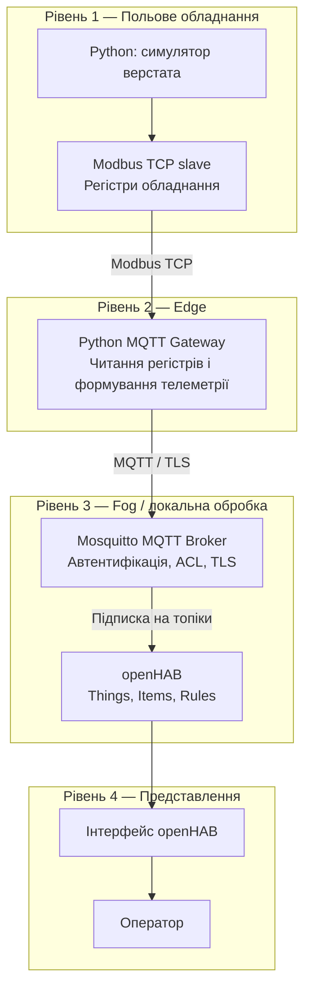

```mermaid
flowchart TB
    subgraph L1["Рівень 1 — Польове обладнання"]
        SIM["Python: симулятор верстата"]
        MODBUS["Modbus TCP slave<br/>Регістри обладнання"]
        SIM --> MODBUS
    end

    subgraph L2["Рівень 2 — Edge"]
        GW["Python MQTT Gateway<br/>Читання регістрів і формування телеметрії"]
        MODBUS -->|"Modbus TCP"| GW
    end

    subgraph L3["Рівень 3 — Fog / локальна обробка"]
        MQTT["Mosquitto MQTT Broker<br/>Автентифікація, ACL, TLS"]
        OH["openHAB<br/>Things, Items, Rules"]
        GW -->|"MQTT / TLS"| MQTT
        MQTT -->|"Підписка на топіки"| OH
    end

    subgraph L4["Рівень 4 — Представлення"]
        UI["Інтерфейс openHAB"]
        OP["Оператор"]
        OH --> UI
        UI --> OP
    end
```
